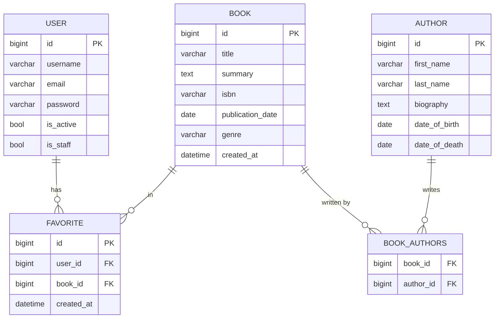

# Library API

REST API для управления книгами и авторами с JWT-аутентификацией, избранными книгами и периодическими уведомлениями.

## Стек технологий

- **Python 3.14** / **Django 6.0** / **Django REST Framework**
- **PostgreSQL** — база данных
- **Redis** — брокер для Celery
- **Celery** — периодические задачи
- **JWT** (djangorestframework-simplejwt) — аутентификация
- **drf-spectacular** — Swagger документация

---

## Требования

- Python 3.14+
- PostgreSQL
- Redis

---

## Установка и запуск

### 1. Клонировать репозиторий

```bash
git clone https://github.com/abitkulovv/library_api.git
cd library_api
```

### 2. Создать виртуальное окружение и установить зависимости

```bash
python -m venv .venv

# Linux/Mac
source .venv/bin/activate

# Windows
.venv\Scripts\activate

pip install -e .
```

Или через `uv`:

```bash
uv sync
```

### 3. Создать файл `.env`

Создай файл `.env` в корне проекта:

```env
SECRET_KEY=your-secret-key

POSTGRES_DB=library_db
POSTGRES_USER=postgres
POSTGRES_PASSWORD=postgres
POSTGRES_HOST=localhost
POSTGRES_PORT=5432

CELERY_BROKER_URL=redis://localhost:6379/0
CELERY_ACCEPT_CONTENT=application/json
CELERY_TASK_SERIALIZER=json
CELERY_RESULT_SERIALIZER=json
CELERY_TIMEZONE=Asia/Bishkek

EMAIL_HOST=smtp.gmail.com
EMAIL_PORT=587
EMAIL_USE_TLS=True
EMAIL_HOST_USER=your@email.com
EMAIL_HOST_PASSWORD=your-app-password
```

### 4. Применить миграции

```bash
python manage.py migrate
```

### 5. Создать суперпользователя (опционально)

```bash
python manage.py createsuperuser
```

### 6. Запустить сервер

```bash
python manage.py runserver
```

---

## Запуск Celery

В отдельных терминалах:

```bash
# Worker — выполняет задачи
celery -A config worker --loglevel=info

# Beat — планировщик (запускает задачи по расписанию)
celery -A config beat --loglevel=info
```

---

## Запуск тестов

```bash
python manage.py test apps --verbosity=2
```

---

## API Документация

После запуска сервера документация доступна по адресу:

- **Swagger UI**: http://localhost:8000/api/docs/
- **OpenAPI Schema**: http://localhost:8000/api/schema/

---

## Эндпоинты

### Аутентификация
| Метод | URL | Описание |
|---|---|---|
| POST | `/api/auth/register/` | Регистрация |
| POST | `/api/auth/login/` | Вход (получить JWT токены) |
| POST | `/api/auth/refresh/` | Обновить access токен |
| GET | `/api/auth/profile/` | Профиль текущего пользователя |
| POST | `/api/auth/logout/` | Выход (блокировка refresh токена) |

### Авторы
| Метод | URL | Описание |
|---|---|---|
| GET | `/api/authors/` | Список авторов |
| POST | `/api/authors/` | Добавить автора |
| GET | `/api/authors/{id}/` | Детали автора |
| PUT/PATCH | `/api/authors/{id}/` | Редактировать автора |
| DELETE | `/api/authors/{id}/` | Удалить автора |

### Книги
| Метод | URL | Описание |
|---|---|---|
| GET | `/api/books/` | Список книг |
| POST | `/api/books/` | Добавить книгу |
| GET | `/api/books/{id}/` | Детали книги |
| PUT/PATCH | `/api/books/{id}/` | Редактировать книгу |
| DELETE | `/api/books/{id}/` | Удалить книгу |

#### Фильтрация, поиск и сортировка книг

```
GET /api/books/?genre=FICTION
GET /api/books/?authors=1
GET /api/books/?publication_date_after=2020-01-01&publication_date_before=2023-01-01
GET /api/books/?search=Толстой
GET /api/books/?ordering=publication_date
GET /api/books/?ordering=-publication_date
```

### Избранное
| Метод | URL | Описание |
|---|---|---|
| GET | `/api/favorites/` | Мои избранные книги |
| POST | `/api/favorites/` | Добавить книгу в избранное |
| DELETE | `/api/favorites/{id}/` | Удалить из избранного |
| DELETE | `/api/favorites/clear/` | Очистить все избранное |

---

## Структура проекта

```
library_api/
├── apps/
│   ├── authors/       # Модель и API авторов
│   ├── books/         # Модель и API книг, Celery задачи
│   ├── favorites/     # Избранные книги
│   └── users/         # Регистрация и аутентификация
├── config/
│   ├── settings.py
│   ├── celery.py
│   └── urls.py
├── manage.py
└── pyproject.toml
```


---

## ER Диаграмма

